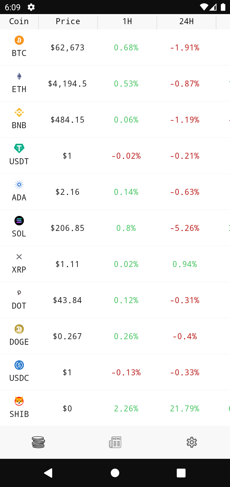

# Coin Compose

Coin Compose is a Android that shows crypto prices and news. 

App is an attempt to use the latest cutting edge libraries and tools. Serves as a playground to try new technologies and architectures.  

 


## Features
* list of cryptocurrencies - showing 210 crypto sorted by market cap using [CoinGecko API](https://www.coingecko.com/en/api)
* cryptocurency details - graph with price movement in the last 7 days and other coin information
* list of latest crypo news - showing 200 latest news using [Cryptopanic API](https://cryptopanic.com)
* settings - possibility to change currency (EUR/USD)
* supports white and dark theme
* caching is implemented on crpyto list screen - it's possible to see prices without connection 

## Android Development 
* Entirely written in [Kotlin](https://kotlinlang.org) and [Jetpack Compose](https://developer.android.com/jetpack/compose)
* Uses [Coroutines](https://kotlinlang.org/docs/coroutines-overview.html)
* Uses [Jetpack Architecture Components](https://developer.android.com/topic/architecture) - [ViewModel](https://developer.android.com/topic/libraries/architecture/viewmodel), [Paging](https://developer.android.com/topic/libraries/architecture/paging/v3-overview), [Navigation](https://developer.android.com/guide/navigation), [DataStore](https://developer.android.com/topic/libraries/architecture/datastore), [Room](https://developer.android.com/training/data-storage/room), [Splashscreen Core](https://developer.android.com/guide/topics/ui/splash-screen)
* Uses [Accompanist](https://google.github.io/accompanist/) - [Swipe Refresh](https://google.github.io/accompanist/swiperefresh/)
* Uses [Retrofit](https://square.github.io/retrofit/) for networking with [OkHttp](https://github.com/square/okhttp) and [Moshi](https://github.com/square/moshi)
* Uses [Coil](https://github.com/coil-kt/coil) for loading images
* Uses [TimberKt](https://github.com/ajalt/timberkt) for logging 

## Building the project
Create `secrets.properties` file in root of the project and add `news_api_key`. You can obtain a new key from [here](https://cryptopanic.com/developers/api/). 

## Where did I get inspiration from?
In this repo I used many examples from other project and articles, there are some of them:
* [Tivi App](https://github.com/chrisbanes/tivi)
* [Minimise App](https://github.com/hitherejoe/minimise)
* [Observing connectivity status](https://medium.com/scalereal/observing-live-connectivity-status-in-jetpack-compose-way-f849ce8431c7)

## License 
```
Copyright 2021 n1k3c (Nikola Curilović) 

Licensed to the Apache Software Foundation (ASF) under one
or more contributor license agreements.  See the NOTICE file
distributed with this work for additional information
regarding copyright ownership.  The ASF licenses this file
to you under the Apache License, Version 2.0 (the
"License"); you may not use this file except in compliance
with the License.  You may obtain a copy of the License at

http://www.apache.org/licenses/LICENSE-2.0

Unless required by applicable law or agreed to in writing,
software distributed under the License is distributed on an
"AS IS" BASIS, WITHOUT WARRANTIES OR CONDITIONS OF ANY
KIND, either express or implied.  See the License for the
specific language governing permissions and limitations
under the License.
```

